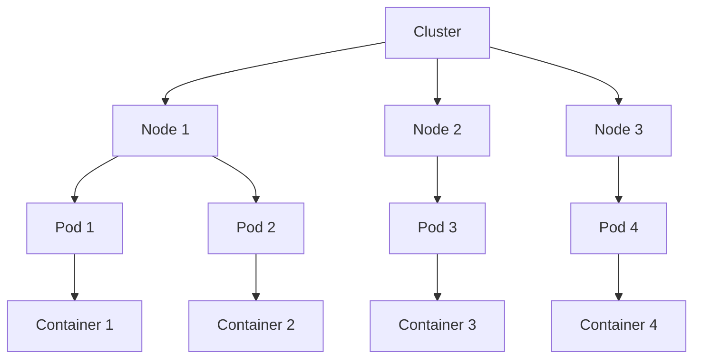
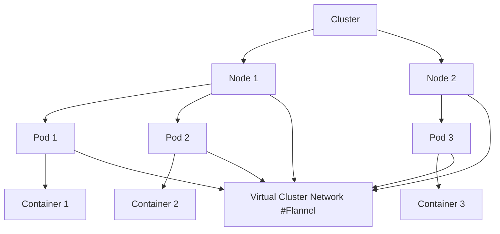

* The course "Kubernetes Essentials" is an introductory course on Kubernetes.
* It provides a basic overview of Kubernetes without delving into all its features.
* The course covers commonly used features and aims to offer hands-on experience.
* Sections in the course:
    1. Introduction to Kubernetes: Covers what Kubernetes is and its purpose.
    1. Building a Kubernetes Cluster: Teaches how to create your own Kubernetes cluster.
    1. Basic Kubernetes Concepts: Discusses essential Kubernetes concepts and core features.
    1. Deploying to Kubernetes: Focuses on application deployment lifecycles and pipelines.
    1. Microservices: Explores how Kubernetes supports microservices and deploys a sample microservice application.
* By completing the course, students gain practical experience with Kubernetes basics.


* The video introduces various features and tools available in the course to facilitate learning about Kubernetes.
* The Playground feature allows users to spin up cloud servers for practice, including setting up a Kubernetes cluster.
* The Community section provides opportunities to interact with other students through Slack and forums for asking questions and seeking help.
* Instructor/Site Support can be accessed for reporting technical issues or problems with the course.
* The Downloads tab offers presentation materials, a cheat sheet, and flashcards for reference and memorization.
* Hands-on labs are available at the end of sections, providing a temporary environment to practice concepts covered in the videos.
* Learners can choose how to use these tools based on their preferences and learning style. Experimentation is encouraged to find the most effective approach.
* Students are encouraged to reach out to the instructor or the community for assistance and questions.


* Kubernetes is introduced as a container orchestration tool for automating the management of containerized applications.
* Containers are explained as self-contained packages that wrap software, allowing it to run consistently in various environments.
* The benefits of containers include portability and automation.
* Orchestration is introduced as the process of managing multiple instances of software across a cluster of servers.
* High availability, scaling resource usage, and deploying code changes are highlighted as common challenges that orchestration tools like Kubernetes can automate.
* Kubernetes is described as a tool that automates the building and management of container infrastructure, allowing users to realize the full benefits of containers.
* The next lesson will involve building a Kubernetes cluster to get hands-on experience with Kubernetes.

* The lesson introduces the process of building a Kubernetes cluster.
* The goal is to enable students to build their own Kubernetes cluster.
* Options for building the cluster include using the Learning Activity, following along with the Playground servers, or using the lessons as a guide.
* The course will focus on creating a simple 3-node Kubernetes cluster with one master and two worker nodes.
* Key components to be installed and configured on each node include Docker (container runtime), kubeadm (cluster setup tool), kubelet (container management agent), and kubectl (command-line tool for cluster interaction).
* The Kubernetes master node will host the control plane services, which are run as containers using kubeadm.
* The subsequent lessons in this section will provide step-by-step guidance on setting up the cluster.


Kube Master
* Docker
* Kubeadm
* Kubelet
* kubectl
* ControlPlane

Kube Node1
* Docker
* Kubeadm
* kubelet
* kubectl

Kube Node2
* Docker
* Kubeadm
* kubelet
* kubectl


## setting up servers
* playground -> setup (Cloud) servers
* use ubuntu distro
* size small
* tag "Kube Master"
> ^ do again for the 2 Nodes with tags "Kube Node1" and "Kube Node2"

## log into servers
* Credentials with IP and temp-password(s)
* use web terminal (log in and change password)


# installing containerd

* The lesson covers the installation of Docker on all three servers to be used for the Kubernetes cluster.
* Docker is a container runtime, responsible for running containers on each node in the cluster.
* Kubernetes requires a container runtime, and Docker is one of the popular choices.
* The tutorial provides commands for adding the Docker GPG key, adding the Docker repository, updating the package listings, and installing Docker Community Edition (CE) with a specific version.
* A version with the version number 18.06.1CE3-0~Ubuntu is specified for consistency and compatibility with Kubeadm.
* The "apt-mark hold" command is used to prevent automatic upgrades of the Docker CE package.
* After successfully installing Docker on the Kubernetes master, the same process is fast-forwarded for the two worker nodes.
* The lesson concludes by verifying the Docker installation with "sudo docker version" on all three nodes to ensure that Docker is working correctly.
* The next step in the cluster setup will involve installing Kubernetes components.


* docker is a container runtime


```bash
# run on all 3 servers

curl -FsFL https://download.docker.com/linux/ubuntu/gpg | sudo apt-key add -
# adds the gpg key 

sudo add-apt-repository "deb [arch=amd64] https://download.docker.com/linux/ubuntu $(lsb_release -cs) stable"
# add to the repo

sudo apt-get update
# update

sudo apt-get install -y docker-ce=18.06.1~ce~3-0~ubuntu 
# install docker (version 18.06.1~ce~3-0~ubuntu)

sudo apt-mark hold docker-ce
# stop it from updating

sudo docker version
# gets version of docker

```

# installing Kubernetes components


* This lesson focuses on installing the Kubernetes components on all three playground servers: Kubeadm, Kubelet, and Kubectl.
* Kubeadm is a tool that automates a significant portion of the process of setting up a new Kubernetes cluster.
* Kubelet is an essential component that must be installed on all servers running Kubernetes containers. It acts as an agent between the Kubernetes API and the Docker container runtime.
* Kubectl is a command-line tool used to interact with the cluster once it's operational, primarily for administrative tasks.
* The tutorial provides commands for adding the Kubernetes GPG key, adding the Kubernetes repository, updating the package listings, and installing specific versions of Kubeadm, Kubelet, and Kubectl.
* The versions are specified for consistency and compatibility with the course.
* An "apt-mark hold" command is used to prevent automated updates for these packages.
* The tutorial begins with installation on the Kubernetes master and then quickly transitions to the two worker nodes, as the process is identical for all three servers.
* Verification is performed by checking the Kubeadm version to ensure the components are installed correctly.
* The next step is to bootstrap the cluster, which will be covered in the next lesson.


# Kubeadm 
* automates standing up the cluster

# Kubelet
* agent for each node (API and runtime)

# KubeCTL
* controlling the cluster and doing cluster operations


```bash
# do this on all 3 servers

curl -s https://packages.cloud.google.com/apt/doc/apt-key.gpg | sudo apt-key add -
# get the kubernetes gpg key

cat << EOF | sudo tee /etc/apt/sources.list.d/kubernetes.list
deb https://apt.kubernetes.io/ kubernetes-xenial main
EOF

deb https://apt.kubernetes.io/ kubernetes-xenial main


sudo apt-get update
# update 

sudo apt-get install -y kubelet=1.12.2-00
sudo apt-get install -y kubeadm=1.12.2-00
sudo apt-get install -y kubectl=1.12.2-00

# or on one line
sudo apt-get install -y kubelet=1.12.2-00 kubeadm=1.12.2-00 kubectl=1.12.2-00

sudo apt-mark hold kubelet kubeadm kubectl
# hold ... no updates

kubeadm version
# show version number

```


# bootstraping the cluster

* In this lesson, the focus is on bootstrapping the Kubernetes cluster.
* The process begins on the Kubernetes master server with the command: `sudo kubeadm init`, including the `--pod-network-cidr` flag set to `10.244.0.0/16`.
* This command initializes the Kubernetes master and may take several minutes to complete.
* After `kubeadm init` is complete, local `kubectl` needs to be set up to interact with the cluster. The necessary commands for setup are provided in the output of `kubeadm init`.
* To join worker nodes to the cluster, a command from the output of `kubeadm init` should be executed on each worker node with `sudo`. However, there may be issues with line breaks in web terminals, so the command should be copied to a text editor and formatted as a single line before execution.
* The verification step involves running `kubectl get nodes` on the master server to ensure that all nodes, including worker nodes, are listed in the cluster.
* Worker nodes may initially appear as "NotReady," which is expected at this stage. They will remain in this state until networking is set up in the next lesson.

```bash

# On the Kube master node, initialize the cluster:

sudo kubeadm init --pod-network-cidr 192.168.0.0/16 --kubernetes-version 1.24.0

# Set kubectl access:

mkdir -p $HOME/.kube
sudo cp -i /etc/kubernetes/admin.conf $HOME/.kube/config
sudo chown $(id -u):$(id -g) $HOME/.kube/config

# The kubeadm init command should output a kubeadm join command containing a token and hash. Copy that command and run it with sudo on both worker nodes. It should look something like this:

sudo kubeadm join $some_ip:6443 --token $some_token --discovery-token-ca-cert-hash $some_hash

# Use can print the full 'kubeadm join' flag needed to join the cluster with the following command:

kubeadm token create --print-join-command

# Run the kubeadm join command on your Kube Node 1 and Kube Node 2 servers:

sudo kubeadm join <IP_ADDRESS> --token <TOKEN> --discovery-token-ca-cert-hash sha256:<HASH>

# From your Kube Master node, verify that all nodes have successfully joined the cluster:

kubectl get nodes

# You should see all three of your nodes listed. It should look something like this:

NAME                           STATUS     ROLES           AGE    VERSION
f8bbdd78c31c.mylabserver.com   NotReady   control-plane   112s   v1.24.0
f8bbdd78c32c.mylabserver.com   NotReady   <none>          55s    v1.24.0
f8bbdd78c33c.mylabserver.com   NotReady   <none>          39s    v1.24.0

# Note: The nodes are expected to have a STATUS of NotReady at this point

kubectl version
# gets the version

```


# networking using flannel

* In this lesson, the focus is on configuring networking using Flannel for the Kubernetes cluster.
* Kubernetes offers various network solutions and plugins, and Flannel is the chosen network plugin for this course.
* A sysctl value, `net.bridge.bridge-nf-call-iptables=1`, needs to be set up on all three servers (master and workers) to configure networking. This is done by echoing the value into `/etc/sysctl.conf` and applying it immediately using `sudo sysctl -p`.
* After configuring sysctl, Flannel is installed on the Kubernetes master using the `kubectl apply -f` command with a YAML file that specifies the necessary objects for Flannel setup.
* The installation of Flannel will make the worker nodes ready, whereas they were previously in the NotReady state.
* To verify Flannel's status, the `kubectl get pods -n kube-system` command is used to check that the Flannel pods are running.
* With Flannel successfully configured, the Kubernetes cluster is fully operational and ready for further exploration of basic Kubernetes concepts in the next section of the course.

```bash

# only on master server

echo "net.bridge.bridge-nf-call-iptables=1" | sudo tee -a /etc/sysctl.conf

sudo sysctl -p

kubectl apply -f https://raw.githubusercontent.com/coreos/flannel/bc79dd1505b0c8681ece4de4c0d86c5cd2643275/Documentation/kube-flannel.yml


kubectl get nodes
#show nodes

kubectl get pods -n kube-system
# show pods


```

```bash

# CHAPTER 2.6 - Configuring Networking with Calico
# https://learn.acloud.guru/course/2e0bad96-a602-4c91-9da2-e757d32abb8f/learn/56bea242-4b92-4bcb-ad80-f974467c8d7a/88143593-a2b1-4ee3-8791-2ba9350c39f9/watch

# Install Calico in the cluster by running this only on the Master node:

kubectl apply -f https://raw.githubusercontent.com/projectcalico/calico/v3.25.0/manifests/calico.yaml

# Verify that all the nodes now have a STATUS of "Ready":

kubectl get nodes

# You should see all three of your servers listed, and all should have a STATUS of "Ready". It should look something like this:

NAME                           STATUS   ROLES           AGE     VERSION
f8bbdd78c31c.mylabserver.com   Ready    control-plane   3m18s   v1.24.0
f8bbdd78c32c.mylabserver.com   Ready    <none>          2m21s   v1.24.0
f8bbdd78c33c.mylabserver.com   Ready    <none>          2m5s    v1.24.0

# Note: It may take a few moments for all nodes to enter the "Ready" status, so if they are not all "Ready", wait a few moments and try again.

# It is also a good idea to verify that the Calico pods are up and running. Run this command to get a list of system pods:

kubectl get pods -n kube-system

# Expected output:

NAME                                                   READY   STATUS    RESTARTS   AGE
calico-kube-controllers-55fc758c88-sklwx               1/1     Running   0          66s
calico-node-2qdd4                                      1/1     Running   0          66s
calico-node-6cblh                                      1/1     Running   0          66s
calico-node-g2czn                                      1/1     Running   0          66s
coredns-6d4b75cb6d-b8m4m                               1/1     Running   0          3m32s
coredns-6d4b75cb6d-r99sr                               1/1     Running   0          3m32s
etcd-f8bbdd78c31c.mylabserver.com                      1/1     Running   0          3m44s
kube-apiserver-f8bbdd78c31c.mylabserver.com            1/1     Running   0          3m46s
kube-controller-manager-f8bbdd78c31c.mylabserver.com   1/1     Running   0          3m45s
kube-proxy-7nx42                                       1/1     Running   0          2m35s
kube-proxy-866ws                                       1/1     Running   0          3m32s
kube-proxy-sbdms                                       1/1     Running   0          2m51s
kube-scheduler-f8bbdd78c31c.mylabserver.com            1/1     Running   0          3m44s

# You should have three pods with "calico" in the name, and all three should have a status of "Running".
```

# Kubernetes Lab

## Nodes
### Master Node
cloud_user
1vXF&%_v
3.237.199.115
### Node1
cloud_user
1vXF&%_v
100.24.113.125
### Node2
cloud_user
1vXF&%_v
44.200.4.160


Building a Kubernetes 1.27 Cluster with `kubeadm`
=================================================

Introduction
------------

This lab will allow you to practice the process of building a new Kubernetes cluster. You will be given a set of Linux servers, and you will have the opportunity to turn these servers into a functioning Kubernetes cluster. This will help you build the skills necessary to create your own Kubernetes clusters in the real world.

Solution
--------

Log in to the lab servers using the credentials provided:

`ssh cloud_user@<PUBLIC_IP_ADDRESS>`

### Install Packages

1.  Log in to the control plane node.
    
    > **Note:** The following steps must be performed on all three nodes.
    
2.  Create the configuration file for containerd:
    
    `cat <<EOF | sudo tee /etc/modules-load.d/containerd.conf 
    overlay 
    br_netfilter 
    EOF`
    
3.  Load the modules:
    
    `sudo modprobe overlay 
    sudo modprobe br_netfilter`
    
4.  Set the system configurations for Kubernetes networking:
    
    `
    cat <<EOF | sudo tee /etc/sysctl.d/99-kubernetes-cri.conf
net.bridge.bridge-nf-call-iptables = 1
net.ipv4.ip_forward = 1
net.bridge.bridge-nf-call-ip6tables = 1
EOF
`
    
5.  Apply the new settings:
    
    `sudo sysctl --system`
    
6.  Install containerd:
    
    `sudo apt-get update && sudo apt-get install -y containerd.io`
    
7.  Create the default configuration file for containerd:
    
    `sudo mkdir -p /etc/containerd`
    
8.  Generate the default containerd configuration, and save it to the newly created default file:
    
    `sudo containerd config default | sudo tee /etc/containerd/config.toml`
    
9.  Restart containerd to ensure the new configuration file is used:
    
    `sudo systemctl restart containerd`
    
10.  Verify that containerd is running:
    
    `sudo systemctl status containerd`
    
11.  Disable swap:
    
    `sudo swapoff -a`
    
12.  Install the dependency packages:
    
    `sudo apt-get update && sudo apt-get install -y apt-transport-https curl`
    
13.  Download and add the GPG key:
    
    `curl -s https://packages.cloud.google.com/apt/doc/apt-key.gpg | sudo apt-key add -`
    
14.  Add Kubernetes to the repository list:
    
    `cat <<EOF | sudo tee /etc/apt/sources.list.d/kubernetes.list 
    deb https://apt.kubernetes.io/ kubernetes-xenial main 
    EOF`
    
15.  Update the package listings:
    
    `sudo apt-get update`
    
16.  Install Kubernetes packages:
    
    > **Note:** If you get a `dpkg lock` message, just wait a minute or two before trying the command again.
    
    `sudo apt-get install -y kubelet=1.27.0-00 kubeadm=1.27.0-00 kubectl=1.27.0-00`
    
17.  Turn off automatic updates:
    
    `sudo apt-mark hold kubelet kubeadm kubectl`
    
18.  Log in to both worker nodes to perform the previous steps.
    

### Initialize the Cluster

1.  Initialize the Kubernetes cluster on the control plane node using `kubeadm`:
    
    `sudo kubeadm init --pod-network-cidr 192.168.0.0/16 --kubernetes-version 1.27.0`
    
2.  Set `kubectl` access:
    
```
mkdir -p $HOME/.kube 
sudo cp -i /etc/kubernetes/admin.conf $HOME/.kube/config 
sudo chown $(id -u):$(id -g) $HOME/.kube/config
```
    
3.  Test access to the cluster:
    
    `kubectl get nodes`
    

### Install the Calico Network Add-On

1.  On the control plane node, install Calico Networking:
    
    `kubectl apply -f https://raw.githubusercontent.com/projectcalico/calico/v3.25.0/manifests/calico.yaml`
    
2.  Check the status of the control plane node:
    
    `kubectl get nodes`
    

### Join the Worker Nodes to the Cluster

1.  In the control plane node, create the token and copy the `kubeadm join` command:
    
    `kubeadm token create --print-join-command`
    
    > **Note:** This output will be used as the next command for the worker nodes.
    
2.  Copy the full output from the previous command used in the control plane node. This command starts with `kubeadm join`.
    
3.  In both worker nodes, paste the full `kubeadm join` command to join the cluster. Use `sudo` to run it as root:
    
    `sudo kubeadm join...`
    
4.  In the control plane node, view the cluster status:
    
    `kubectl get nodes`
    
    > **Note:** You may have to wait a few moments to allow all nodes to become ready.
    

Conclusion
----------

Congratulations — you've completed this hands-on lab!


# Containers and Pods


# Topic: 
This section of the course covers basic Kubernetes concepts.

# Pods: 
Pods are the fundamental building blocks of Kubernetes. They are the smallest unit and serve as the environment for running containers.

# Pod Composition: 
Pods can contain one or more containers. Typically, there is one container per pod, but multiple containers can coexist within a pod.

# Pod Characteristics:
Each pod has its own storage resources.
Pods are assigned a unique IP address within the Kubernetes cluster network.

# Kubernetes Operations: 
When working with Kubernetes, interactions often involve creating, managing, and deleting pods.

# Pod Creation Example: 
Demonstrates how to create a pod using YAML configuration. In this example, an nginx pod is created.
The YAML configuration includes the pod name, specifications, and container details (e.g., image).

# kubectl Commands:

## kubectl get pods: 
Lists the pods in the current namespace (default) or a specified namespace.

## kubectl describe pod [pod_name]: 
Provides detailed information about a specific pod, including node assignment, start time, IP address, container details, and events.

## kubectl delete pod [pod_name]: 
Deletes a pod.

# Namespaces: 
Kubernetes organizes objects into namespaces. Pods, by default, belong to the "default" namespace.
Object Types: In Kubernetes, various objects, such as pods, services, and deployments, are managed using similar kubectl get and kubectl describe commands.

# Cleanup: 
Demonstrates how to delete a pod using kubectl delete pod [pod_name].

# Kubernetes Exploration: 
Provides a basic understanding of working with pods and interacting with them using kubectl.

This lesson serves as an introduction to the core concept of pods in Kubernetes, how to create and interact with them using kubectl, and the relevance of namespaces within a Kubernetes cluster.

```bash

cat << EOF | kubectl create -f -
apiVersion: v1
kind: Pod
metadata:
    name: nginx
spec:
    containers:
        - name: nginx
        image: nginx
EOF


kubectl get pods
# lists pods


kubectl get pods -n kube-system
# list all kube system pods


kubectl describe pod -nginx
# shows info about the nginx pod

kubectl delete pod nginx
# deletes the nginx pod

```

# cluster and nodes


# Topic: 
Discussion of clustering and nodes in Kubernetes.

# Cluster Architecture: 
Kubernetes operates in a clustered architecture, which means it utilizes multiple servers to run containers, offering redundancy and scalability.

# Nodes: 
In a Kubernetes cluster, servers that run containers are referred to as nodes. There are two main types of nodes:

## Control Servers (Kubernetes Master): 
These servers manage and control the entire cluster, hosting the Kubernetes API. Multiple control servers can be set up for high availability.

## Worker Nodes: 
These nodes are responsible for running application workloads (containers) managed by Kubernetes.

# Worker Node Role: 
Worker nodes execute the actual application workloads within the Kubernetes cluster.

# Cluster Architecture Example: 
Provides a simplified diagram illustrating the layout of control servers and worker nodes.

# Exploring Nodes:
## kubectl get nodes: 
Command used to list all nodes in the cluster.
## kubectl describe node [node_name]: 
Command to retrieve detailed information about a specific node, including resource allocation and event history.

# Node Information: 
Understanding node details, such as allocated resources and events, is crucial for monitoring and troubleshooting purposes.

# Resource Allocation: 
Information about allocated resources on a node helps predict when additional resources may be needed.

# Troubleshooting: 
Event history and node information are valuable for diagnosing and resolving issues within the cluster.


```bash

kubectl get nodes
# list the nodes

kubectl describe node [name_of_node]
# see info about a node - and resources used by the node


```


# Netwoirking with Kubernetes


# Topic: 
Overview of networking in Kubernetes.

# Importance of Networking: 
Understanding Kubernetes networking at a high level is crucial when working with Kubernetes clusters.

# Kubernetes Networking Model:
* Kubernetes establishes a virtual network that spans the entire cluster, separate from the physical network connecting individual nodes.
* Each pod in the cluster has a unique IP address, enabling communication with other pods, even if they are on different nodes.
* Pods communicate using IP addresses without needing to know the physical location of other pods.

# Network Implementation:
* Various Kubernetes plugins implement this networking model differently, catering to different environments.
* Flannel is one such plugin that creates the virtual network, allowing seamless communication between pods on different nodes.

# Demonstration:
* Pods are created within the cluster, including two Nginx web server pods and one BusyBox pod (useful for testing).
* By examining pod details using kubectl get pods -o wide, the unique IP addresses and node assignments are visible.
* A command is executed inside the BusyBox pod to demonstrate network communication.
* The BusyBox pod successfully contacts an Nginx pod running on a different node using the virtual network, highlighting Kubernetes networking functionality.

The lesson provides a general understanding of Kubernetes networking, emphasizing the concept of a virtual network that enables communication between pods across different nodes in the cluster. This knowledge is essential for Kubernetes cluster management and troubleshooting.


```bash

cat << EOF | kubectl create -f -
apiVersion: apps/v1
kind: Deployment
metadata:
  name: nginx
  labels:
    app: nginx
spec:
  replicas: 2
  selector:
    matchLabels:
      app: nginx
  template:
    metadata:
      labels:
        app: nginx
    spec:
      containers:
      - name: nginx
        image: nginx:1.15.4
        ports:
        - containerPort: 80
EOF

# Create a busybox pod to use for testing:
cat << EOF | kubectl create -f -
apiVersion: v1
kind: Pod
metadata:
  name: busybox
spec:
  containers:
  - name: busybox
    image: radial/busyboxplus:curl
    args:
    - sleep
    - "1000"
EOF

# Get the IP addresses of your pods:
kubectl get pods -o wide

# Get the IP address of one of the nginx pods, then contact that nginx pod from the busybox pod using the nginx pod's IP address:
kubectl exec busybox -- curl $nginx_pod_ip

```







# Kubernetes Architecture and Components


Here are the key points about the basic architecture and components of Kubernetes:

* Kubernetes is composed of multiple components that work together to manage a cluster.
* The essential components of Kubernetes include etcd, kube-apiserver, kube-controller-manager, and kube-scheduler, which together form the Kubernetes control plane or master.
* Etcd serves as the distributed synchronized data storage for the cluster state, ensuring data consistency across multiple master nodes.
* Kube-apiserver provides the primary REST-based web API interface for interacting with the Kubernetes cluster.
* Kube-controller-manager handles the behind-the-scenes work of controlling the cluster and includes various services for cluster management.
* Kube-scheduler determines when and where to run pods within the cluster.
* Kubelet is an agent that runs on each node and facilitates communication between the Kubernetes API and the container runtime (e.g., Docker).
* Kube-proxy handles network communication between nodes, including routing traffic between pods on different nodes.
* These components collectively form the architecture of a Kubernetes cluster, with the control plane components residing on the master node, and kubelet and kube-proxy running on each node.
* It's important to have a basic understanding of these components to work effectively with Kubernetes.

For more detailed information, you can refer to the Kubernetes documentation.


```bash
kubectl get pods -n kube-system
# all system pods:
# etcd - synced data store for kubernetes and dataobjects
# kube-apiserver - rest api for interfacing with the kubernetes cluster
# kube controller manager - all backend stuff (services and pieces)
# kube-scheduler - when to run pods and nodes to run them on
# kube-flannel - virtual network
# ^ these are in kube-master

sudo systemctl status kubelet
# checks the status of a kubelet service

# kube-proxy 
# handles networking between nodes

```


# Kubernetes Deployments

Here's a summary of the key points about Kubernetes deployments:

* Kubernetes deployments are objects used to manage and organize pods within a cluster.
* Deployments enable users to define a desired state for their applications, and Kubernetes ensures that the cluster maintains that state.
* Deployments offer features like scaling, rolling updates, and self-healing for pods.
* Scaling with deployments involves specifying the number of replicas, and Kubernetes automatically manages the creation or removal of pods to meet that replica count.
* Rolling updates allow for gradual deployment of new versions of applications, minimizing downtime by replacing old pods incrementally.
* Deployments ensure self-healing by automatically replacing pods if they are deleted or go offline, maintaining the desired number of replicas.
* Deployments are a powerful tool for managing application lifecycles in Kubernetes clusters.
* Creating a deployment involves specifying the desired state and defining the pod template within the deployment.
* The `kubectl get deployments` command lists deployments, and `kubectl describe deployment` provides detailed information about a specific deployment.
* Deployments ensure that the specified number of replicas is maintained, even if pods are manually deleted or experience failures.

These key points provide an overview of Kubernetes deployments and their capabilities in managing applications within a cluster.

```bash

#Create a deployment:

cat <<EOF | kubectl create -f -apiVersion: apps/v1
kind: Deployment
metadata: 
name: nginx-deployment  
labels: 
app: nginx 
spec: 
replicas: 2  
selector: 
matchLabels: 
app: nginx  
template: 
metadata: 
labels: 
app: nginx  
spec:
containers: 
- name: nginx
image: nginx:1.15.4 
ports:
- containerPort: 80
EOF


#Get a list of deployments:
kubectl get deployments


#Get more information about a deployment:
kubectl describe deployment nginx-deployment


#Get a list of pods:
kubectl get pods

```